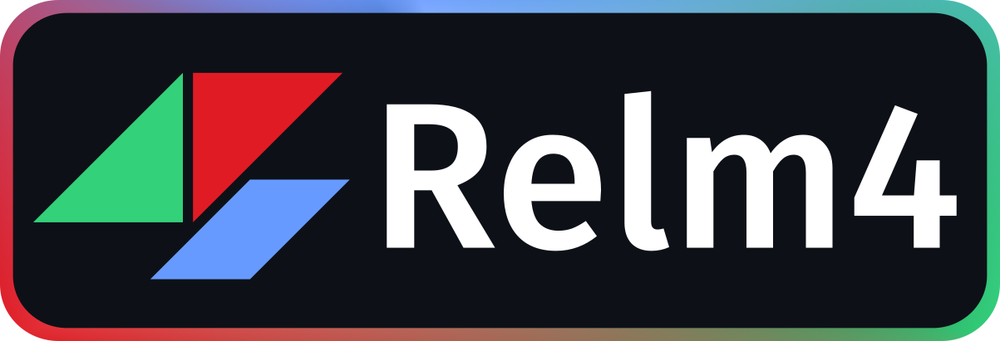
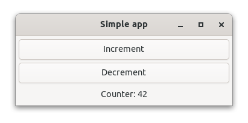
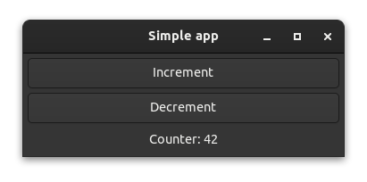

<h1>
  
</h1>

[](https://github.com/AaronErhardt/relm4/actions/workflows/rust.yml)
[](https://matrix.to/#/#relm4:matrix.org)
[](https://crates.io/crates/relm4)
[](https://aaronerhardt.github.io/docs/relm4/relm4/)
[](https://aaronerhardt.github.io/relm4-book/book/)


An idiomatic GUI library inspired by [Elm](https://elm-lang.org/) and based on [gtk4-rs](https://crates.io/crates/gtk4). 
Relm4 is a new version of [relm](https://github.com/antoyo/relm) that's built from scratch and is compatible with [GTK4](https://www.gtk.org/) and [libadwaita](https://gitlab.gnome.org/GNOME/libadwaita).

## Why Relm4

We believe that GUI development should be easy, productive and delightful.  
The [gtk4-rs](https://crates.io/crates/gtk4) crate already provides everything you need to write modern, beautiful and cross-platform applications.
Built on top of this foundation, Relm4 makes developing more idiomatic, simpler and faster and enables you to become productive in just a few hours.

## Our goals

+ ⏱️ **Productivity**
+ ✨ **Simplicity**
+ 📎 **Outstanding documentation**
+ 🔧 **Maintainability**

## Documentation

+ 📖 **[The Relm4 book](https://aaronerhardt.github.io/relm4-book/book/)**
+ 📜 **[Rust documentation](https://aaronerhardt.github.io/docs/relm4/relm4/)**

## Dependencies

Relm4 depends on GTK4: [How to install GTK4](https://www.gtk.org/docs/installations/).

## Ecosystem

Relm4 has two crates that extend the core functionality:

+ [relm4-macros](https://crates.io/crates/relm4-macros) provides a `widget` macro that simplifies UI creation
+ [relm4-components](https://crates.io/crates/relm4-components) is a collections of reusable components you can easily integrate into your application

Add this to your `Cargo.toml`:

```toml
gtk = { version = "0.3", package = "gtk4" }
relm4 = "0.2"
relm4-macros = "0.2"
relm4-components = "0.2"
```

### Features

The relm4 crate has two feature flags:

+ tokio-rt: Adds the `AsyncWorker` type that uses an async update function
+ libadwaita: Improved support for [libadwaita](https://gitlab.gnome.org/World/Rust/libadwaita-rs)

## Examples

Several example applications are available at [relm4-examples/](relm4-examples/).

#### [📸 Screenshots from the example apps](assets/screenshots)

### A simple counter app




```rust
use gtk::prelude::{BoxExt, ButtonExt, GtkWindowExt, OrientableExt};
use relm4::{send, AppUpdate, Model, RelmApp, Sender, WidgetPlus, Widgets};

#[derive(Default)]
struct AppModel {
    counter: u8,
}

enum AppMsg {
    Increment,
    Decrement,
}

impl Model for AppModel {
    type Msg = AppMsg;
    type Widgets = AppWidgets;
    type Components = ();
}

impl AppUpdate for AppModel {
    fn update(&mut self, msg: AppMsg, _components: &(), _sender: Sender<AppMsg>) -> bool {
        match msg {
            AppMsg::Increment => {
                self.counter = self.counter.wrapping_add(1);
            }
            AppMsg::Decrement => {
                self.counter = self.counter.wrapping_sub(1);
            }
        }
        true
    }
}

#[relm4_macros::widget]
impl Widgets<AppModel, ()> for AppWidgets {
    view! {
        gtk::ApplicationWindow {
            set_title: Some("Simple app"),
            set_default_width: 300,
            set_default_height: 100,
            set_child = Some(&gtk::Box) {
                set_orientation: gtk::Orientation::Vertical,
                set_margin_all: 5,
                set_spacing: 5,

                append = &gtk::Button {
                    set_label: "Increment",
                    connect_clicked(sender) => move |_| {
                        send!(sender, AppMsg::Increment);
                    },
                },
                append = &gtk::Button {
                    set_label: "Decrement",
                    connect_clicked(sender) => move |_| {
                        send!(sender, AppMsg::Decrement);
                    },
                },
                append = &gtk::Label {
                    set_margin_all: 5,
                    set_label: watch! { &format!("Counter: {}", model.counter) },
                }
            },
        }
    }
}

fn main() {
    let model = AppModel::default();
    let app = RelmApp::new(model);
    app.run();
}

```

## License

Licensed under either of

 * Apache License, Version 2.0, ([LICENSE-APACHE](LICENSE-APACHE) or http://www.apache.org/licenses/LICENSE-2.0)
 * MIT license ([LICENSE-MIT](LICENSE-MIT) or http://opensource.org/licenses/MIT)

at your option.

### Contribution

Unless you explicitly state otherwise, any contribution intentionally submitted
for inclusion in the work by you, as defined in the Apache-2.0 license, shall be dual licensed as above, without any
additional terms or conditions.

**Feedback and contributions are highly appreciated!**
